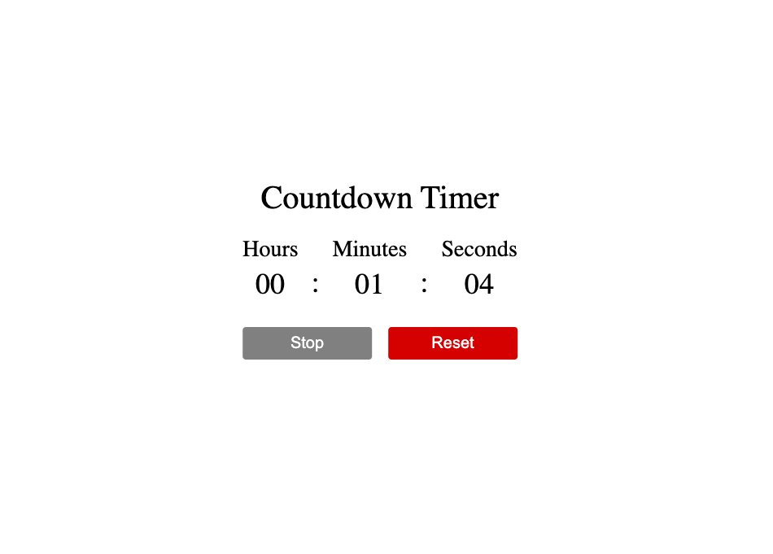

# Countdown Timer

A simple countdown timer built with HTML, CSS, and JavaScript.

## Features

- **Start**: Start the countdown timer.
- **Stop**: Pause the countdown timer.
- **Continue**: Resume the paused countdown timer.
- **Reset**: Reset the countdown timer to zero.

## Demo

## Usage
- Click the **Start** button to begin the countdown.
- Click the **Stop** button to pause the countdown.
- Click the **Continue** button to resume the countdown.
- Click the **Reset** button to reset the countdown to zero.

**Project Link** : 

